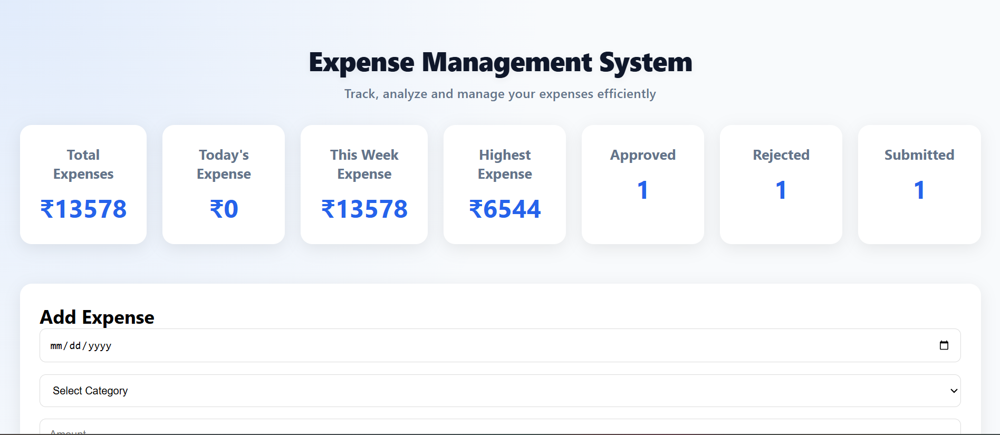
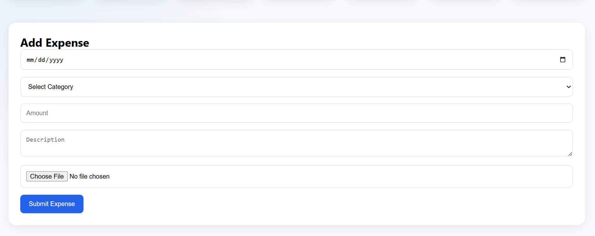
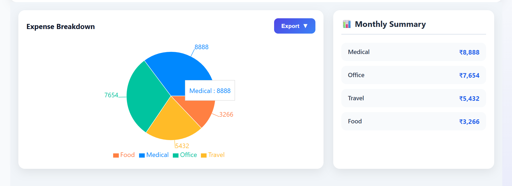
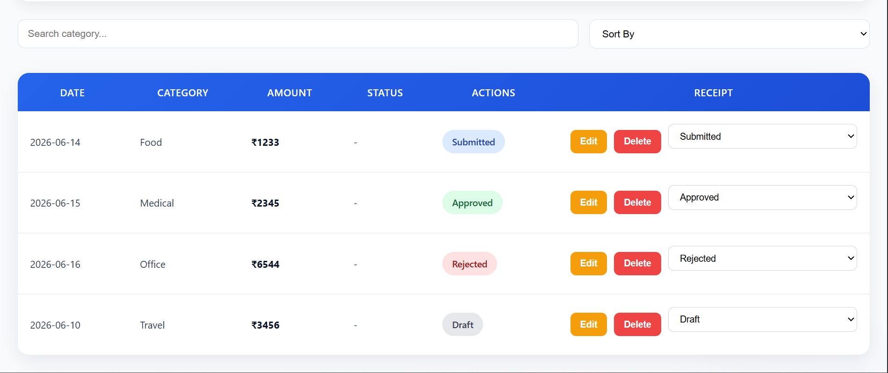

# Expense Management System

A modern Expense Management System built with React that helps users track, manage, analyze, and export expenses efficiently.

## Features

- Add, Edit, and Delete Expenses
- Search and Filter Expenses
- Category-wise Expense Tracking
- Date & Amount Sorting
- Analytics Dashboard Cards
- Interactive Pie Chart (Recharts)
- Monthly Summary Section
- Receipt Upload Support
- Export Reports (CSV & PDF)
- Local Storage Persistence
- Responsive Design (Mobile, Tablet, Desktop)
- Toast Notifications

## Tech Stack

- React.js
- JavaScript (ES6+)
- Recharts
- jsPDF
- CSS3


## Screenshots

### Dashboard



### Expense Form



### Analytics



### Expense Table




## Installation

```bash
npm install
npm run dev
```

## Project Structure

```text
src/
├── components/
├── pages/
├── utils/
├── App.jsx
└── main.jsx
```

## Future Enhancements

- Backend Integration (Spring Boot / Node.js)
- MySQL Database Storage
- User Authentication
- Excel Export
- Expense Reports & Insights

## Author

Kathiravan P